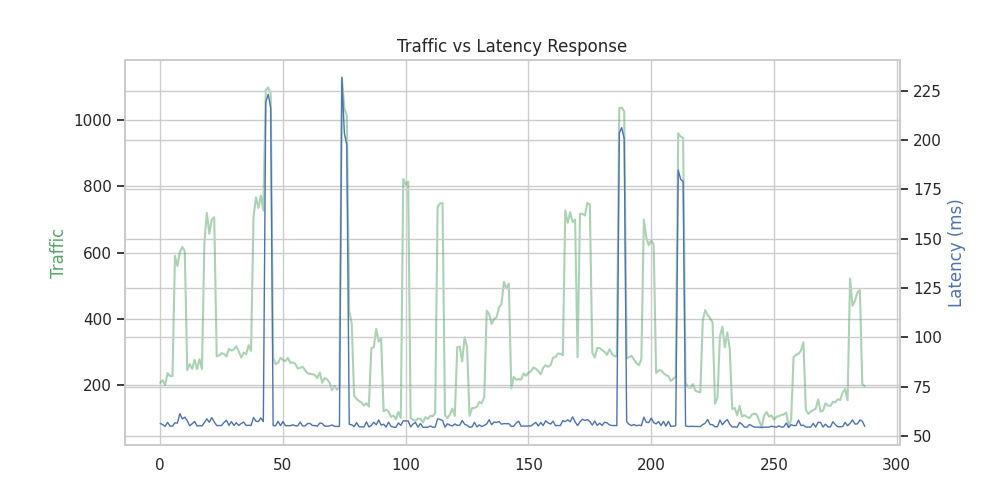
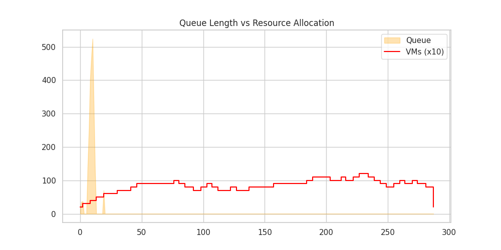
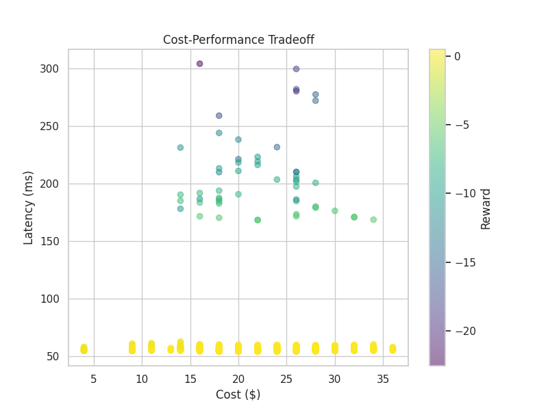
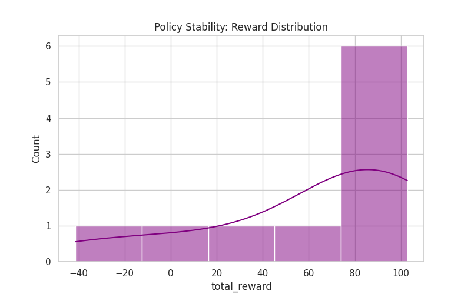
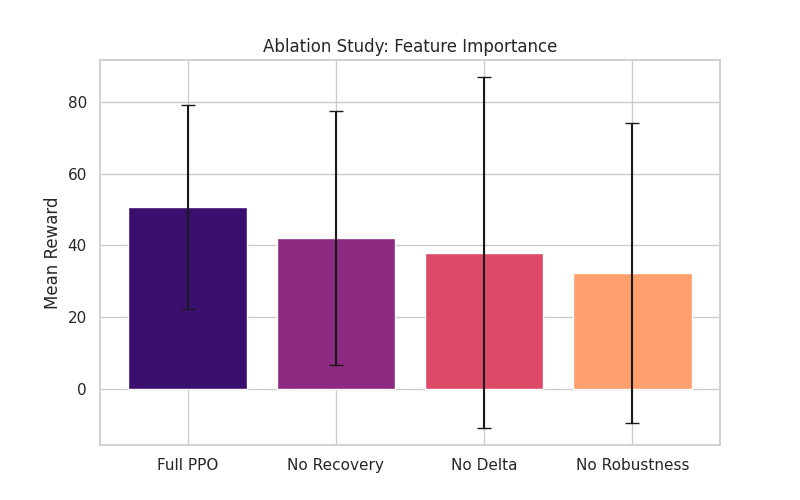
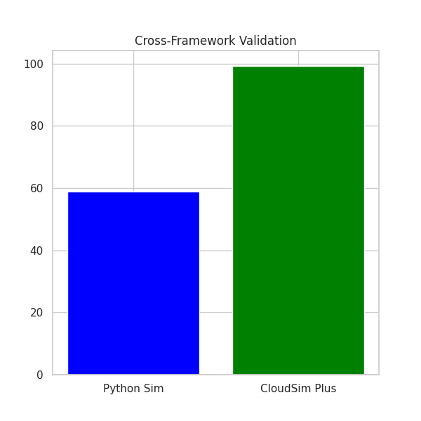

# Cloud Cost Optimization using PPO + Safety Controller (v2)

> Reinforcement Learning driven cloud autoscaling system with cross-framework validation, safety overrides, and rich performance analytics.

---

## Overview
This project implements an **intelligent cloud autoscaling controller** using **Proximal Policy Optimization (PPO)** for dynamic VM resource management under bursty traffic conditions.

The goal is to optimize the tradeoff between:

- **low latency / SLA compliance**
- **resource cost**
- **system stability**
- **safe intervention logic**

The project evolved into a full systems pipeline with:

- custom Python cloud simulator
- PPO-based autoscaling policy
- MCP-style controller override layer
- baseline & ablation studies
- CloudSim Plus validation
- performance visualization dashboard

---

## Key Features

### RL-Based Autoscaling
- PPO-based agent trained on custom cloud environment
- 7-action scaling space
- reward shaping with cost-latency tradeoff
- recovery incentives
- safety-aware fine tuning

### Safety Controller Layer
Rule-based override system for safe production-like decisions.

Includes:
- fallback scaling logic
- SLA breach override
- emergency scale-up
- intervention monitoring

### Validation
Cross-framework validation performed using **CloudSim Plus**.

This ensures policy consistency beyond the custom simulator.

---

## Action Space

| Action | Meaning |
|---|---|
| 0 | No Operation |
| 1 | Scale Up Small |
| 2 | Scale Up Medium |
| 3 | Scale Up Large |
| 4 | Scale Down Small |
| 5 | Scale Down Medium |
| 6 | Scale Down Large |

---

## Results & Visualizations

---

### Traffic vs Latency Response
Shows how latency reacts under traffic bursts.



Key insight:
- latency remains stable during normal load
- sharp spikes during burst regions
- PPO quickly restores SLA-safe region

---

### Queue Length vs Resource Allocation
Shows system recovery and VM response.



Key insight:
- early queue spike handled quickly
- VM scaling staircase reflects proactive scaling
- minimal queue after stabilization

---

### Cost-Performance Tradeoff
One of the most important plots in the project.



This visualizes:
- cost
- latency
- reward

This directly represents the optimization objective.

---

### Policy Stability
Distribution of cumulative rewards across runs.



Key insight:
- most episodes lie in positive reward zone
- small negative tail under stress scenarios
- strong policy consistency

---

### Ablation Study
Feature importance analysis.



Compared variants:
- Full PPO
- No Recovery
- No Delta
- No Robustness

Key takeaway:
The full model consistently performs best.

---

### Cross-Framework Validation
Python simulator vs CloudSim Plus.



This validates trend consistency across simulation frameworks.

---

## Final Performance Summary

| Metric | Value |
|---|---:|
| Best PPO Reward | 67.05 |
| Intervention Ratio | ~4% |
| CloudSim Avg Finish Time | 92.33 |
| Baseline Winner | PPO |
| Validation Status | PASS |

---

## Project Structure

```text
cloud-cost-optimization-v2/
│
├── models/
├── plots/
├── cloudsim_validation/
├── reward_function.py
├── gym_wrapper.py
├── mcp_controller.py
├── dashboard.py
├── ablation_study.py
├── compare_policies.py
├── evaluate_ppo.py
└── README.md
```

---

## Tech Stack

- Python
- PyTorch
- Stable Baselines3
- Gymnasium
- CloudSim Plus (Java)
- Matplotlib
- NumPy

---

## Future Work (v3)

Planned improvements:

- config-driven architecture
- FastAPI serving layer
- Pareto optimization
- multi-objective RL
- live dashboard
- better scale-down learning
- deployment-ready system design

---

## Author
**Ishaan Singh**

Built as an advanced RL + systems engineering project focused on cloud autoscaling and intelligent infrastructure control.
